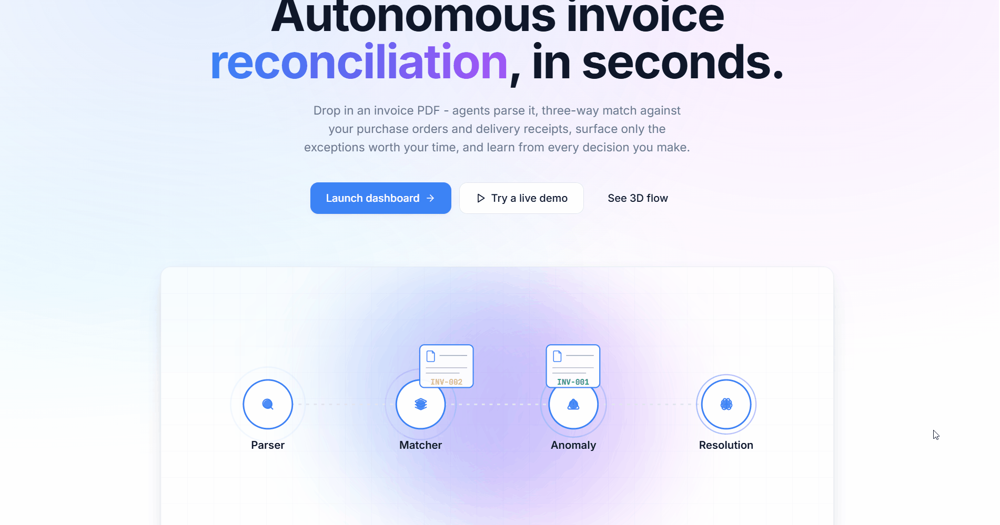

# Agentic Invoice Reconciliation

A production-grade, full-stack multi-agent system that automates 3-way invoice matching (Purchase Order vs Invoice vs Delivery Receipt) using LangGraph, with human-in-the-loop for exceptions, RAG over historical decisions, full observability via Langfuse, and an Apple-quality React frontend featuring a live pipeline visualizer, side-by-side document comparison, and a 3D reconciliation flow.



## Architecture

```
                          +------------------+
                          |  Invoice Upload  |
                          |     (PDF)        |
                          +--------+---------+
                                   |
                                   v
+-------------+           +------------------+
|   FastAPI   +---------->+   Redis Queue    |
|  (REST API) |           +--------+---------+
+-------------+                    |
                                   v
                          +------------------+
                          | Background Worker|
                          +--------+---------+
                                   |
              +--------------------+--------------------+
              |        LangGraph Agent Pipeline         |
              |                                         |
              |  +----------+  +----------+  +--------+ |
              |  |  Parser  +->+ Matcher  +->+Anomaly | |
              |  |  Agent   |  |  Agent   |  | Agent  | |
              |  |(LLM+PDF) |  |(SQL+Emb) |  |(Rules) | |
              |  +----------+  +----------+  +---+----+ |
              |                                  |      |
              |                          +-------v----+ |
              |                          | Resolution | |
              |                          |   Agent    | |
              |                          | (LLM+RAG)  | |
              |                          +------+-----+ |
              +---------------------------------+-------+
                                                |
                              +-----------------+-----------------+
                              |                                   |
                      +-------v-------+                 +---------v---------+
                      |  Auto-Approve |                 |   Human Review    |
                      |  (no issues)  |                 | (pending review)  |
                      +---------------+                 +-------------------+

Infrastructure: PostgreSQL+pgvector | Redis | Ollama (Qwen 2.5 7B) | Langfuse
```

## Tech Stack

### Backend

| Layer | Technology | Purpose |
|---|---|---|
| LLM | Qwen 2.5 7B (via Ollama) | Invoice parsing, resolution recommendations |
| Embeddings | Qwen3-Embedding-0.6B (via Ollama) | 1024-dim vectors for RAG + description matching |
| Agent Framework | LangGraph | Stateful agent orchestration with checkpointing |
| Backend | FastAPI (async) | REST API with webhook support |
| Database | PostgreSQL 16 + pgvector | Structured data + vector similarity search |
| Cache / Queue | Redis 7 | Job queuing for async invoice processing |
| Observability | Langfuse v3 (self-hosted) | End-to-end pipeline tracing |
| Eval | Promptfoo | LLM output evaluation and regression testing |
| Deployment | Docker + Docker Compose | Containerized services |

### Frontend

| Layer | Technology | Purpose |
|---|---|---|
| Build tool | Vite 5 | Lightning-fast dev server |
| Framework | React 18 + TypeScript | Type-safe UI with FastAPI types mirrored |
| Styling | TailwindCSS + shadcn/ui | Apple-quality component library |
| Animations | Framer Motion | Spring physics, page transitions |
| 3D | React Three Fiber + drei | Three.js with React |
| Server state | TanStack Query | Auto-caching, polling, mutations |
| Charts | Tremor / custom | Match rate, processing time, discrepancies |
| PDF | react-pdf | PDF rendering for compare view |

## Features

### Backend

- **Stateful Multi-Agent Pipeline**: 4 specialized agents (Parser, Matcher, Anomaly, Resolution) orchestrated via LangGraph with conditional routing and error handling
- **3-Way Line-Item Matching**: Compares invoice line items against PO and delivery receipt data at the individual line level
- **8 Anomaly Detection Checks**: Duplicate invoices, price deviations, quantity mismatches, missing POs, missing receipts, date anomalies, amount overages, unauthorized vendors
- **Human-in-the-Loop**: Exceptions route to humans via API with agent-generated recommendations
- **RAG Over Historical Decisions**: Past reconciliation outcomes are embedded and retrieved to improve future recommendations
- **Full Observability**: Every agent step traced via Langfuse with processing time metrics
- **Production-Ready**: Docker deployment, async processing, Redis queuing, health checks

### Frontend

- **Apple-quality UI**: Light/dark mode with system-aware toggle, generous whitespace, soft shadows, frosted glass effects, spring-physics animations
- **Live Pipeline Visualizer**: Watch each agent execute in real-time with timing and click any stage to inspect its output
- **Side-by-Side Document Compare**: PDF viewer next to matched PO/delivery data with animated SVG match lines
- **3D Reconciliation Flow**: Cinematic Three.js scene of invoices flowing through the pipeline
- **PO and Vendor management**: Full CRUD for purchase orders and vendors with detail sheets, dynamic line-item editor, vendor combobox picker, and bulk CSV import
- **Command Palette**: Global search + navigation, opened with `⌘K` on macOS or `Ctrl+K` on Windows/Linux
- **Real-time Updates**: TanStack Query polls for status changes during processing
- **Mobile-Responsive**: Works on phones, tablets, and desktops

## Database Schema

12 normalized tables with proper FK constraints, CHECK constraints, and indices:

```
vendors ---< purchase_orders ---< po_line_items
   |              |
   |              +---< delivery_receipts ---< delivery_line_items
   |
invoices ---< invoice_line_items
   |
   +---< reconciliations ---< line_item_matches
              |                    |
              +---< discrepancies -+
              +---< human_reviews
              +---< reconciliation_embeddings (pgvector)
```

## Prerequisites

- [Docker Desktop](https://www.docker.com/products/docker-desktop/)
- [Ollama](https://ollama.com/download)
- [Python 3.11+](https://www.python.org/downloads/)
- [Node.js LTS](https://nodejs.org/) (for Promptfoo)

## Setup

### 1. Clone and configure

```bash
git clone https://github.com/nnoman-asif/agentic-invoice-reconciliation.git
cd agentic-invoice-reconciliation

cp .env.example .env
# Edit .env if you need to change defaults
```

### 2. Pull Ollama models

```bash
ollama pull qwen2.5:7b
ollama pull qwen3-embedding:0.6b
```

### 3. Start infrastructure

```bash
# Core services (PostgreSQL + Redis)
docker compose up -d postgres redis

# Wait for services to be healthy, then create tables
pip install -r requirements.txt
python -m app.db.setup_db

# Seed sample data
python -m app.db.seed
```

### 4. Generate sample invoice PDFs

```bash
pip install reportlab
python -m sample_data.generate_sample_pdfs
```

### 5. Start the backend

```bash
# Terminal 1: FastAPI server
uvicorn app.main:app --reload --port 8000

# Terminal 2: Background worker
python -m app.worker
```

### 6. Start the frontend

```bash
# Terminal 3: Vite dev server
cd frontend
npm install
npm run dev
```

Open **http://localhost:5173** in your browser.

### 7. (Optional) Start Langfuse for observability

```bash
docker compose --profile observability up -d
# Langfuse UI at http://localhost:3000
# Note: this conflicts with the frontend Docker service on port 3000
# Run frontend in dev mode (npm run dev on 5173) when using observability profile
```

### Full Docker setup (alternative)

To run everything in containers:

```bash
docker compose up -d
# Frontend: http://localhost:3000
# Backend:  http://localhost:8000
```

## API Reference

### Invoice Processing

```bash
# Upload an invoice for processing
curl -X POST http://localhost:8000/api/invoices/upload \
  -F "file=@sample_data/invoices/invoice_clean_match.pdf"

# List all invoices
curl http://localhost:8000/api/invoices

# Get invoice details
curl http://localhost:8000/api/invoices/{invoice_id}

# Get reconciliation result
curl http://localhost:8000/api/invoices/{invoice_id}/reconciliation
```

### Human-in-the-Loop

```bash
# List exceptions pending review
curl http://localhost:8000/api/exceptions

# Approve an exception
curl -X POST http://localhost:8000/api/exceptions/{reconciliation_id}/approve \
  -H "Content-Type: application/json" \
  -d '{"reviewer_notes": "Price increase was pre-approved", "decided_by": "admin"}'

# Reject an exception
curl -X POST http://localhost:8000/api/exceptions/{reconciliation_id}/reject \
  -H "Content-Type: application/json" \
  -d '{"reviewer_notes": "Unauthorized price change", "decided_by": "admin"}'
```

### Data Management

```bash
# Purchase orders
curl http://localhost:8000/api/purchase-orders                              # list
curl http://localhost:8000/api/purchase-orders/{po_id}                      # detail (with line items)
curl http://localhost:8000/api/purchase-orders/{po_id}/invoices             # invoices reconciled against this PO

# Vendors
curl http://localhost:8000/api/vendors                                      # list
curl http://localhost:8000/api/vendors/{vendor_id}                          # detail
curl http://localhost:8000/api/vendors/{vendor_id}/purchase-orders          # POs from this vendor
curl http://localhost:8000/api/vendors/{vendor_id}/invoices                 # invoices from this vendor
curl http://localhost:8000/api/vendors/{vendor_id}/stats                    # aggregated counts

# Delivery receipts (filter by PO with ?po_id=)
curl "http://localhost:8000/api/delivery-receipts?po_id={po_id}"

# Dashboard stats
curl http://localhost:8000/api/dashboard/stats

# Health check
curl http://localhost:8000/health
```

POs and vendors also support write operations:
`POST /api/{purchase-orders,vendors}` to create,
`PUT /api/{purchase-orders,vendors}/{id}` to update,
`DELETE /api/{purchase-orders,vendors}/{id}` to remove.

POs return **409** on `DELETE` when reconciliations reference them
(pass `?force=true` to detach and delete anyway). Vendors return
**409** when POs or invoices reference them — those references must
be reassigned or removed first (the schema FKs are `RESTRICT`).
Full request/response shapes live in the Swagger UI at
**http://localhost:8000/docs**.

### Bulk CSV Imports

Both purchase orders and vendors can be loaded in bulk from a CSV
file. Use the **Import CSV** button on the Purchase Orders or Vendors
page in the UI, or call the endpoints directly. Both return HTTP 200
with `{imported, skipped, errors}` so partial success is supported —
only an unparseable file returns 400.

**Purchase orders** — one row per *line item*; rows sharing a
`po_number` are grouped into a single PO. PO-level columns must be
identical within each group; the total amount is computed from the
line items.

```
po_number,vendor_code,issue_date,expected_delivery_date,currency,notes,line_number,item_code,item_description,quantity,unit_price,unit_of_measure
```

```bash
curl -X POST http://localhost:8000/api/purchase-orders/import \
  -F "file=@frontend/public/samples/purchase-orders-template.csv"
```

**Vendors** — one row per vendor. Only `code` and `name` are required.

```
code,name,tax_id,address,contact_email
```

```bash
curl -X POST http://localhost:8000/api/vendors/import \
  -F "file=@frontend/public/samples/vendors-template.csv"
```

Sample templates live in [`frontend/public/samples/`](frontend/public/samples)
and are also reachable inside the app from the Import dialog.

### Webhook

`POST /api/webhooks/invoice-received` re-queues an existing invoice for
processing. Use it when:

- An ERP / upstream system has dropped a row directly into the
  `invoices` table and you want the agent pipeline to pick it up.
- An invoice ended up stuck in `queued` (e.g., the worker was down
  when the upload happened) or `failed` and you want to retry it.

```bash
curl -X POST http://localhost:8000/api/webhooks/invoice-received \
  -H "Content-Type: application/json" \
  -d '{"invoice_id": "<uuid>"}'
```

Returns `200 {"status": "queued", "invoice_id": "..."}` on success,
`409` if the invoice is already `parsing`/`matching`/`resolving`/`completed`,
`400` for a bad UUID, or `404` if the id is unknown.

Interactive API docs available at **http://localhost:8000/docs** (Swagger UI).

## Agent Pipeline

```
+-------------------+     +--------------------+     +-------------------+
| 1. Parser Agent   |     | 2. Matcher Agent   |     | 3. Anomaly Agent  |
|                   | --> |                    | --> |                   |
| LLM extracts      |     | SQL finds matching |     | Rule engine runs  |
| structured data   |     | PO & delivery      |     | 8 checks for      |
| from invoice PDF  |     | receipts, does     |     | discrepancies     |
|                   |     | 3-way line match   |     |                   |
+-------------------+     +--------------------+     +--------+----------+
                                                              |
                                                              v
                                                  +-------------------+
                                                  | 4. Resolution     |
                                                  |    Agent          |
                                                  |                   |
                                                  | LLM + RAG decides |
                                                  | auto-approve or   |
                                                  | human review      |
                                                  +-------------------+
```

## Eval Suite

Run LLM evaluations with Promptfoo:

```bash
cd eval
npx promptfoo@latest eval -c promptfoo.yaml
npx promptfoo@latest view
```

Tests cover:
- Parser accuracy (field extraction from different invoice formats)
- Structured JSON output validation
- Edge cases (missing fields, different date formats)


## Known Simplifications

These are intentional scope decisions for v1:

- **1:1 invoice-to-PO mapping**: Multi-PO invoices are not supported (each invoice matches at most one PO)
- **No authentication**: Human reviewer identity is stored as a plain string, no auth system
- **No soft deletes**: Records are hard-deleted
- **Single currency**: Cross-currency reconciliation flags a discrepancy rather than converting

## Docker Commands

```bash
# Start core services only
docker compose up -d postgres redis

# Start everything including Langfuse
docker compose --profile observability up -d

# View logs
docker compose logs -f app

# Reset database
python -m app.db.setup_db --reset
python -m app.db.seed

# Stop all
docker compose down
```

## License

All Rights Reserved
